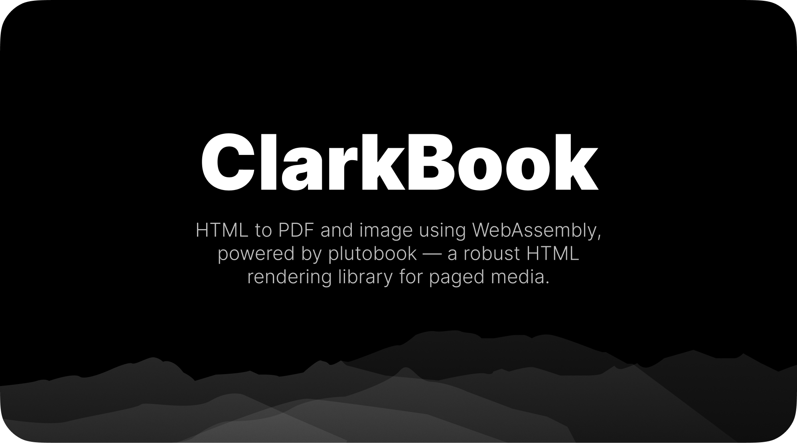

# ClarkBook

HTML to PDF and image using WebAssembly, powered by [plutobook](https://github.com/plutoprint/plutobook) — a robust HTML rendering library for paged media. Does not depend on Chromium, WebKit, or Gecko.

## Install

```sh
npm install clarkbook
```

## Usage

```js
import { createBook, PageSize, Margins } from "clarkbook";

const book = await createBook();

// Render to PDF
const pdf = book.pdf("<h1>Hello</h1>", {
  pageSize: PageSize.A4,
  margins: Margins.Normal,
});

// Render to image
const image = book.image("<h1>Hello</h1>", {
  format: "png",
  width: 1200,
  height: 800,
});
```

### Custom fonts

```js
import { readFile } from "node:fs/promises";

const book = await createBook({
  fonts: [
    ["Inter.ttf", await readFile("./Inter.ttf")],
  ],
});
```

### Next.js

```js
import path from "node:path";
import { createBook } from "clarkbook";
import { NextResponse } from "next/server";
import fs from "node:fs/promises";

const fontFile = path.join(
  process.cwd(),
  "app/fonts/GoogleSans-VariableFont_GRAD,opsz,wght.ttf",
);

const book = await createBook({
  fonts: [["GoogleSans.ttf", await fs.readFile(fontFile)]],
});

export async function GET() {
  const buffer = book.image("<h1>Hello, world</h1>", {
    format: "jpeg",
  });

  return new NextResponse(new Uint8Array(buffer), {
    status: 200,
    headers: {
      "Content-Type": "image/jpeg",
      "Content-Disposition": 'inline; filename="document.jpg"',
    },
  });
}
```

### Resources

Pass additional assets (images, stylesheets) via `resources`:

```js
const pdf = book.pdf(html, {
  resources: {
    "https://example.com/style.css": await readFile("./style.css"),
  },
  baseUrl: "https://example.com/",
});
```

## API

### `createBook(options?)`

| Option  | Type                              | Description          |
| ------- | --------------------------------- | -------------------- |
| `fonts` | `[name: string, data: Uint8Array][]` | Custom font files |

Returns a `Book` instance.

### `book.pdf(html, options?)`

| Option      | Type                    | Default         |
| ----------- | ----------------------- | --------------- |
| `pageSize`  | `[number, number]`      | `PageSize.A4`   |
| `margins`   | `[number, number, number, number]` | `Margins.Normal` |
| `resources` | `Record<string, Uint8Array>` | `{}`       |
| `userStyle` | `string`                | `""`            |
| `baseUrl`   | `string`                | `""`            |

Returns `Uint8Array`.

### `book.image(html, options?)`

Extends `pdf` options with:

| Option    | Type                          | Default  |
| --------- | ----------------------------- | -------- |
| `format`  | `"png" \| "jpeg" \| "webp"`   | `"png"`  |
| `width`   | `number`                      | `-1`     |
| `height`  | `number`                      | `-1`     |
| `quality` | `number`                      | `90`     |

Returns `Uint8Array`.

### `PageSize`

`A3`, `A4`, `A5`, `B4`, `B5`, `Letter`, `Legal`, `Ledger`

### `Margins`

`None`, `Narrow`, `Normal`, `Moderate`, `Wide`

## License

MPL-2.0

## Credits

Built on [plutobook](https://github.com/plutoprint/plutobook) by the plutoprint project.
